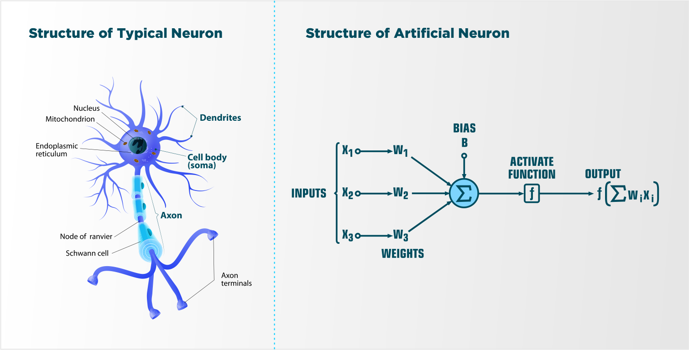

# Creating an Artificial Neural Network from Scratch, with an Application for Time Series Quantitative Trading

## YouTube Series
Delve deeper into the subject with our YouTube series: [Neural Networks for Quantitative Trading](https://www.youtube.com/watch?v=Wo5dMEP_BbI&list=PLQVvvaa0QuDcjD5BAw2DxE6OF2tius3V3)

## Motivation For Project

My academic journey through deep learning in school sparked a profound interest in the operational intricacies of neural networks. While my coursework laid a solid foundation, I realized that mastering the true complexities and capabilities of these models requires hands-on experimentation. By moving away from high-level frameworks like Keras or TensorFlow, and opting to build a neural network from scratch, this project aims to uncover the core mechanisms that drive neural computations, offering a clearer view into the inner workings of machine learning.

## What even is a Neural Network?

With a background in Cognitive Science, Neuroscience, Computer Science, and Psychology, I find neural networks fascinating as they represent a convergence of these fields. A neural network is a computational framework inspired by the structure of the brain, designed to recognize patterns and make decisions from input data. It consists of layers of artificial neurons or "nodes" interconnected by weighted paths. These weights are dynamically adjusted based on the network's exposure to data, analogous to synaptic adjustments in biological neurons. Each neuron computes its output using a mathematical function, which then becomes input for the next layer. The primary goal of this architecture is to emulate the learning processes of the brain, allowing the machine to enhance its abilities in complex tasks like image recognition, language processing, and strategic decision-making, similar to human learning from experience.

**Eventual Goal:** To develop a neural network capable of trading foreign commodity option contracts effectively.

## Basic Steps of a Neural Network:

### 1. Basic Structure
- **Input Layer**: The entry point for input data, where each neuron corresponds to a unique feature of the dataset.
- **Hidden Layers**: Intermediate layers that process inputs through a series of weighted connections, learning complex patterns and relationships in the data.
- **Output Layer**: Delivers the final output of the network, such as a prediction or classification, depending on the task (e.g., a binary classification for a cat vs. dog decision).

### 2. Forward Propagation
- **Data Flow**: Input data flows through the network from the input layer to the output layer via hidden layers.
- **Activation Functions**: These are crucial for introducing non-linearity into the network, enabling it to learn and perform more complex tasks than mere linear classification.

### 3. Loss Calculation
- **Objective**: Post forward propagation, the network computes its performance by comparing the output with the true labels using a loss function.
- **Loss Function Examples**: Mean squared error for regression tasks, and cross-entropy loss for classification tasks.

### 4. Backpropagation
- **Purpose**: To refine the weights of the network by minimizing the loss. This process involves the backward propagation of the error gradient, adjusting weights to reduce discrepancies between actual and predicted outputs.
- **Optimization Algorithms**: Such as Gradient Descent, which incrementally adjusts weights to minimize the loss function.

### 5. Iteration and Convergence
- **Epochs**: The entire process of forward propagation, loss calculation, and backpropagation is repeated over multiple iterations, known as epochs, until the model's accuracy plateaus or achieves a predetermined level of performance.

### 6. Model Evaluation
- **Validation**: Post-training, the model is validated against a set of data that was not used during training to check its generalization capabilities.
- **Testing**: The final step, testing, involves evaluating the model against completely unseen data to ensure it performs well under new conditions.

### Key Concepts and Terminology:
- **Parameters Growth**: The complexity and size of parameters can expand significantly with each added layer or neuron, influencing both the computational demand and the model's capacity to learn finer details.
- **Homogeneity in Arrays**: Ensuring that data arrays and weights are properly aligned in shape for matrix operations is crucial to avoid runtime errors.

### Advanced Topics:
- **Activation Functions Detailed**:
  - **Sigmoid**: Offers a smooth gradient, useful for outputs between 0 and 1.
  - **ReLU**: Provides a simple, efficient non-linear transformation, which is less computationally expensive than sigmoid and helps with faster convergence.
  - **Softmax**: Converts logits to probabilities, commonly used in the output layer of a classifier to interpret the neural outputs as probabilities.

### Practical Considerations:
- **Batching**: Grouping large sets of data into batches allows for more efficient computation, particularly on GPUs, which are optimized for parallel processing over CPUs.
- **Overfitting vs. Underfitting**: Balancing
