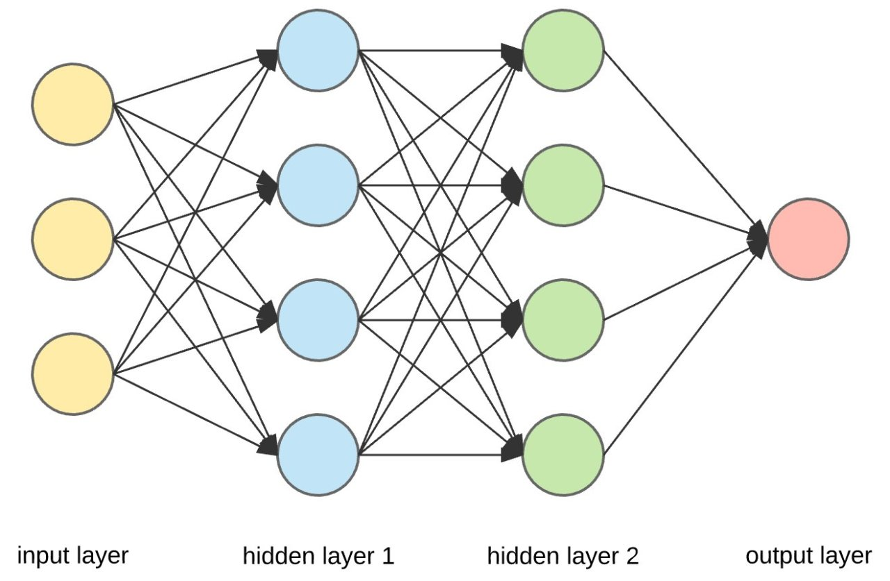

# Neural Network

YouTube Series: https://www.youtube.com/watch?v=Wo5dMEP_BbI&list=PLQVvvaa0QuDcjD5BAw2DxE6OF2tius3V3

Basic Steps of Neural Network:
1. Basic Structure
- Input Layer: Receives input data.
- Hidden Layers: Multiple layers that process the input through weighted connections.
- Output Layer: Produces the final prediction or classification.
