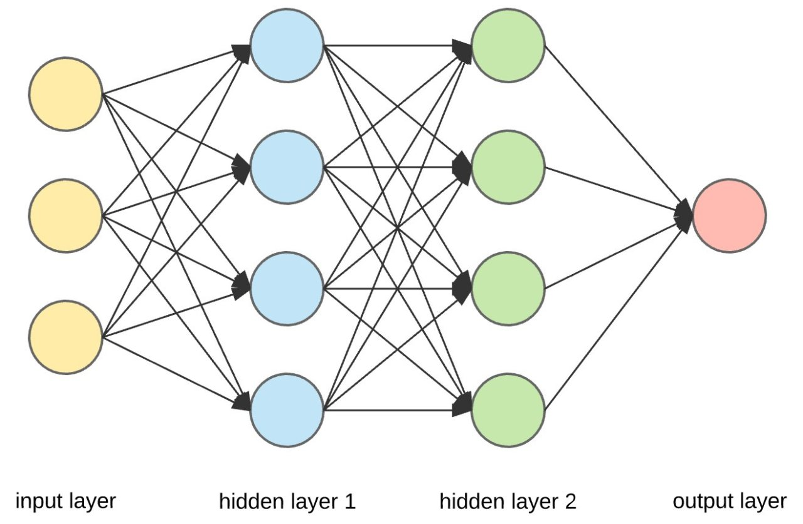
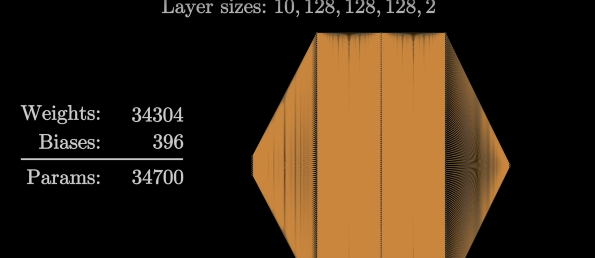

# Creating an Artificial Neural Network from Scratch, with an Application for Time Series Quantitative Trading

## YouTube Series
Explore this topic through the YouTube series: [Neural Networks for Quantitative Trading](https://www.youtube.com/watch?v=Wo5dMEP_BbI&list=PLQVvvaa0QuDcjD5BAw2DxE6OF2tius3V3)

## Basic Steps of a Neural Network:
### 1. Basic Structure
- **Input Layer**: Receives the input data.
- **Hidden Layers**: Consist of multiple layers that process the input through weighted connections.
- **Output Layer**: Produces the final prediction or classification.

- The model is termed a neural network because it resembles a network.
- Data flows from the input layer to multiple hidden layers and finally to the output layer.
- For example, if classifying between a cat or a dog, the output layer will have two neurons.
- The training process involves tuning the "weights and biases".

- Note that the number of parameters can grow significantly.
- Inputs can originate from the input layer or be outputs from other neurons.
- Weights have a multiplicative effect, whereas biases have an additive effect.
- Arrays must be homologous, meaning each dimension must be of the same size.

#### Talking About Shape
- It's common to encounter shape errors in deep learning.

Examples of array structures:

**1D Array (Vector):**
- Array: [1, 5, 6, 2]
- Shape: (4,)

**2D Array (Matrix):**
- Array: 
        [[1, 5, 6, 2],
        [3, 2, 1, 3]]

- Shape: (2, 4)

- A tensor is an object that can be represented as an array.

#### Dot Product
Example calculation of a dot product:

- Arrays:
- a = [1, 2, 3]
- b = [2, 3, 4]

- Calculation:
- dot_product = (a[0] * b[0]) + (a[1] * b[1]) + (a[2] * b[2])
- Result: 20

- when doing a dot product multiplication inputs x weights is not the same as weights x inputs, and you'll receive an error. This is because weights isn't a vector but rather an array. 

example:
inputs = [1,2,3,2.5]
weights =  [[0.2, 0.8, -0.5, 1.0],
            [0.5, -0.91, 0.26, -0.5],
            [-0.26, -0.27, 0.17, 0.87]]
