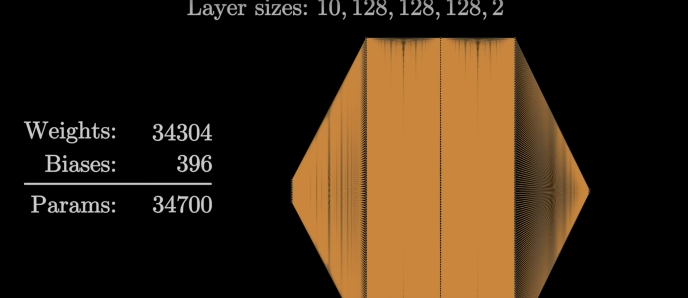

# Creating an Artificial Neural Network from Scratch, with an Application for Time Series Quantitative Trading

## YouTube Series
Explore this topic through the YouTube series: [Neural Networks for Quantitative Trading](https://www.youtube.com/watch?v=Wo5dMEP_BbI&list=PLQVvvaa0QuDcjD5BAw2DxE6OF2tius3V3)

## Motivation For Project

As someone who has studied deep learning in school, I've always been intrigued by the operational intricacies of neural networks. While my coursework provided a foundational understanding, the true complexities and capabilities of these models are best grasped through hands-on experience. Instead of relying solely on high-level frameworks like Keras or TensorFlow, I decided to challenge myself by constructing a basic neural network from scratch. This project aims to strip down the often opaque layers of machine learning libraries, revealing the core mechanisms that drive neural computations. 

## What even is a Neural Network? 

This topic has been particularly fascinating to me because in my undergraduate studies, I studied Cognitive Science, Computer Science which consisted mostly of Neuroscience, Computer Science, and Psychology. Neural networks are the meeting point of these three disciplines.

A neural network is a computational model inspired by the structure of the brain, designed to recognize patterns and make decisions based on input data. Like the human brain, which is composed of neurons interconnected by synapses, a neural network consists of layers of artificial neurons or "nodes" connected by weighted paths.  These weights adjust as the network learns from data, mimicking the process of synaptic strengthening or weakening in biological neurons. Each artificial neuron processes its inputs using a mathematical function to produce an output, which then serves as input to subsequent layers. The goal of this architecture is to simulate the learning capabilities of the brain, enabling the machine to improve its performance on tasks such as image recognition, language processing, and decision-making through experience, much like a human learns from sensory inputs.

Eventual goal: make neural network for foreign commodity option contracts. 

## Basic Steps of a Neural Network:
### 1. Basic Structure
- **Input Layer**: Receives the input data.
- **Hidden Layers**: Consist of multiple layers that process the input through weighted connections.
- **Output Layer**: Produces the final prediction or classification.

- The model is termed a neural network because it resembles a network.
- Data flows from the input layer to multiple hidden layers and finally to the output layer.
- For example, if classifying between a cat or a dog, the output layer will have two neurons.
- The training process involves tuning the "weights and biases".

- Note that the number of parameters can grow significantly.
- Inputs can originate from the input layer or be outputs from other neurons.
- Weights have a multiplicative effect, whereas biases have an additive effect.
- Arrays must be homologous, meaning each dimension must be of the same size.

#### Talking About Shape
- It's common to encounter shape errors in deep learning.

Examples of array structures:

**1D Array (Vector):**
- Array: [1, 5, 6, 2]
- Shape: (4,)

**2D Array (Matrix):**
- Array: 
        [[1, 5, 6, 2],
        [3, 2, 1, 3]]

- Shape: (2, 4)

- A tensor is an object that can be represented as an array.

#### Dot Product
Example calculation of a dot product:

- Arrays:
- a = [1, 2, 3]
- b = [2, 3, 4]

- Calculation:
- dot_product = (a[0] * b[0]) + (a[1] * b[1]) + (a[2] * b[2])
- Result: 20

- when doing a dot product multiplication inputs x weights is not the same as weights x inputs, and you'll receive an error. This is because weights isn't a vector but rather an array. 

example:
inputs = [1,2,3,2.5]
weights =  [[0.2, 0.8, -0.5, 1.0],
            [0.5, -0.91, 0.26, -0.5],
            [-0.26, -0.27, 0.17, 0.87]]

#### batching 
- the more things you can do in parallel the better 
- this is why neural network training is done usually on gpus which have thousands of cores, compared to cpus which only have 4 or 8 cores. 
- when we batch the amount of samples (show multiple samples to the model) the model does better and is trained more efficiently
- small batch sizes have aan increased risk of overfitting 
- large batch size have an increased risk of underfitting
- usual batch size is 32 -- sometimes 64 or 128

#### shape error
- in dot product len(element1[1]) must == len(element2[0])
- to fix this we need to transpose (swap rows and columns)

#### Activation Functions
- Step function 
- Sigmoid function (0 or 1 output)
        - more granular than the step function
- ReLu (Rectified Linear Unit)
        - it's faster than sigmoid
- do a deep dive on why activation functions are unique and the power they add to none linearity

#### softmax

- softmax activation function
        - want output values of neural net to be a probability distribution
        - relu will turn a negative number into a zero so the probability distribution gets screwed up
        - also we need to deal with negative values in the output of the network

exponentiation
- y = e ^ x
        - solves negative issue but keeps the information of the negatives compared to abs 
what is eulers number? 

normalization 
- value over total sum 

#### calculating loss with categorial cross - entropy

